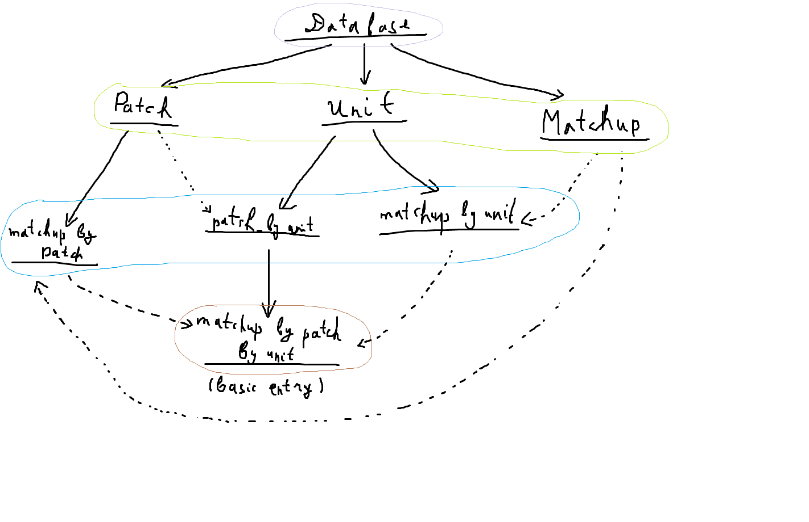

# Work in progress
This project had been planned to be client-side WebAssembly app written in C++ to display the wc3 ladder replay data stats.

Data structure scheme

One of the cool parts of the project is a highly performant hand-crafted serialization system used to pack and store the data for hundreds of thousands of replay files (tens of GBs): all of those should be able to fit into mere 10-20KB.

Serialization diagram sketch

---
Although the project is frozen atm, the work on it is at the 2nd priority and will be resumed right after the Teve project will have been finished.